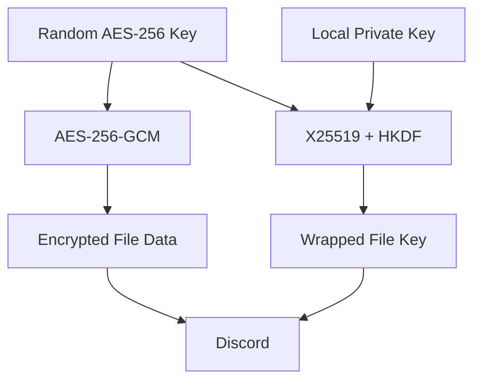

# DiscordVault

Encrypted file storage using Discord as a storage backend.

DiscordVault encrypts files locally with **AES-256-GCM**, splits the encrypted data into chunks, encodes the chunks as lossless PNGs, and stores them as Discord attachments.

> Experimental project for learning about cryptography, encrypted storage, chunking, and API-based storage backends.

---

## Architecture

```mermaid
flowchart LR
    A[File / Folder] --> B{Input Type}

    B -->|File| C[Read File]
    B -->|Folder| D[Create Temporary ZIP]

    C --> E[Generate AES-256 Key]
    D --> E

    E --> F[AES-256-GCM]
    F --> G[Encrypted Data]

    G --> H[Split into Chunks]
    H --> I[Encode as PNG]

    E --> J[X25519 Key Wrapping]
    J --> K[Wrapped File Key]

    I --> L[Encrypted Chunks]
    K --> M[Manifest]

    L --> N[Discord]
    M --> N

    N --> O[Download]
    O --> P[Decrypt + Verify]

    P --> Q{Original Type}
    Q -->|File| R[Restore File]
    Q -->|Folder| S[Extract ZIP]
    S --> T[Restore Folder]
````

### Upload / Restore Flow

```mermaid
sequenceDiagram
    participant User
    participant Vault as DiscordVault
    participant Discord

    User->>Vault: upload file/folder
    Vault->>Vault: Encrypt + chunk
    Vault->>Vault: Generate manifest
    Vault->>Discord: Upload manifest + chunks
    Discord-->>Vault: Upload complete
    Vault->>Vault: Delete temporary encrypted data

    User->>Vault: restore VAULT_ID
    Vault->>Discord: Download vault
    Discord-->>Vault: Manifest + encrypted chunks
    Vault->>Vault: Decrypt + verify SHA-256
    Vault-->>User: Restore to ./restored/
    Vault->>Vault: Delete temporary data
```

---

## Features

* AES-256-GCM authenticated encryption
* X25519-based key wrapping
* HKDF-SHA256 key derivation
* SHA-256 integrity verification
* Automatic chunking
* Lossless PNG encoding
* File and folder support
* Automatic ZIP handling for folders
* Discord bot/API storage
* Vault metadata listing
* Automatic temporary-file cleanup
* Local encryption/decryption
* File restoration

---

## How It Works

### Files

```text
file
 │
 ▼
AES-256-GCM
 │
 ▼
encrypted data
 │
 ▼
chunks
 │
 ▼
PNG images
 │
 ▼
Discord
```

### Folders

Folders are temporarily converted into a ZIP archive before encryption.

```text
my-project/
├── src/
├── tests/
└── README.md

       ↓

temporary ZIP
       ↓
AES-256-GCM
       ↓
encrypted chunks
       ↓
Discord
```

The temporary ZIP and encrypted chunks are automatically removed after a successful upload.

---

## CLI

### Upload

The normal workflow is a single command:

```bash
python -m src.main upload data/input/soloLeveling.mp4
```

For a folder:

```bash
python -m src.main upload ./my-project
```

DiscordVault internally:

1. Encrypts the input.
2. Creates the required chunks.
3. Uploads the manifest and chunks.
4. Removes the temporary encrypted data.

No manually created `data/output/` vault is required.

---

### List Vaults

```bash
python -m src.main list
```

Example:

```text
Vaults
────────────────────────────────────────────────

1. soloLeveling.mp4
   ID:       c326642e77664612924cb1746e879199
   Type:     file
   Size:     1.42 GB
   Chunks:   242
   Chunk:    6.07 MB
   SHA-256:  a1b2c3d4e5f6...

2. my-project
   ID:       91c8...
   Type:     directory
   Size:     8.42 MB
   Chunks:   2
   Chunk:    6.07 MB
   SHA-256:  f6e5d4c3b2a1...
```

The Discord message itself only contains the vault identifier and storage metadata. The detailed file information comes from the vault manifest.

---

### Restore

Restore using only the vault ID:

```bash
python -m src.main restore <VAULT_ID>
```

The file is automatically restored under:

```text
restored/
└── original-file-name
```

For example:

```text
restored/
└── soloLeveling.mp4
```

Folders are reconstructed automatically:

```text
restored/
└── my-project/
    ├── src/
    ├── tests/
    └── README.md
```

Temporary downloaded chunks are removed after the restore process finishes.

You can also specify an output path:

```bash
python -m src.main restore <VAULT_ID> ./my-output
```

If the vault ID is invalid, the CLI reports a clean error instead of exposing a Python traceback:

```text
Error: vault 'invalid-id' was not found.
```

---

### Local Encode / Decode

The lower-level commands are still available for development and testing.

```bash
python -m src.main encode input.bin vault/
```

```bash
python -m src.main decode vault/ recovered.bin
```

Normal users generally only need:

```text
upload
list
restore
```

---

## Encryption

Each vault receives a randomly generated AES-256 key.



The private key remains on the user's machine and is never uploaded to Discord.

SHA-256 is used for integrity verification of:

* Individual encrypted chunks
* The final reconstructed file

SHA-256 is **not** used as encryption.

---

## Project Structure

```text
discord-vault/
│
├── src/
│   ├── crypto.py
│   ├── discord_client.py
│   ├── key_manager.py
│   ├── main.py
│   └── vault.py
│
├── tests/
├── data/
│   └── input/
│
├── .discord-vault/
├── restored/
├── .env
├── .gitignore
├── requirements.txt
└── README.md
```

| Module              | Responsibility                          |
| ------------------- | --------------------------------------- |
| `crypto.py`         | Encryption and key wrapping             |
| `key_manager.py`    | Local key management                    |
| `vault.py`          | Encoding, chunking, manifests, decoding |
| `discord_client.py` | Discord API and storage operations      |
| `main.py`           | Command-line interface                  |

---

## Setup

```bash
git clone <repository-url>
cd discord-vault

python -m venv .venv
source .venv/bin/activate

pip install -r requirements.txt
```

Configure the Discord bot:

```env
DISCORD_BOT_TOKEN=your_bot_token
DISCORD_CHANNEL_ID=your_channel_id
```

Generate the local encryption keypair using the project's key-management command.

Run the test suite:

```bash
python -m pytest
```

---

## Security Notes

Discord receives encrypted file data rather than the original plaintext.

However, Discord can still observe some operational metadata, including:

* Attachment sizes
* Timestamps
* Number of attachments
* Vault existence

The current manifest also contains file metadata.

The local private key is required to decrypt the vault.

**Never commit:**

```text
.env
.discord-vault/private.key
data/output/
generated vault data
```

Losing the private key can make encrypted vaults unrecoverable.

---

## Temporary Data

Normal uploads and restores use temporary directories.

```text
Upload:

Input
  ↓
Temporary encrypted vault
  ↓
Discord
  ↓
Temporary vault deleted


Restore:

Discord
  ↓
Temporary encrypted vault
  ↓
Decrypt + verify
  ↓
restored/
  ↓
Temporary vault deleted
```

This prevents encrypted PNG chunks and intermediate files from accumulating in the project directory.

---

## Tests

Run all tests with:

```bash
python -m pytest
```

The test suite covers the core cryptographic, encoding, chunking, and vault functionality.

---

## Future Improvements

* [ ] Encrypted manifests for stronger metadata privacy
* [ ] Resumable uploads/downloads
* [ ] Better Discord rate-limit handling
* [ ] Parallel chunk transfers
* [ ] Compression before encryption
* [ ] Deduplication
* [ ] Incremental backups
* [ ] Additional storage backends
* [ ] Improved progress reporting
* [ ] Vault deletion

---

## Disclaimer

DiscordVault is an experimental project and is not intended to replace dedicated backup or archival-storage systems.

Keep an independent backup of important data and the private encryption key.