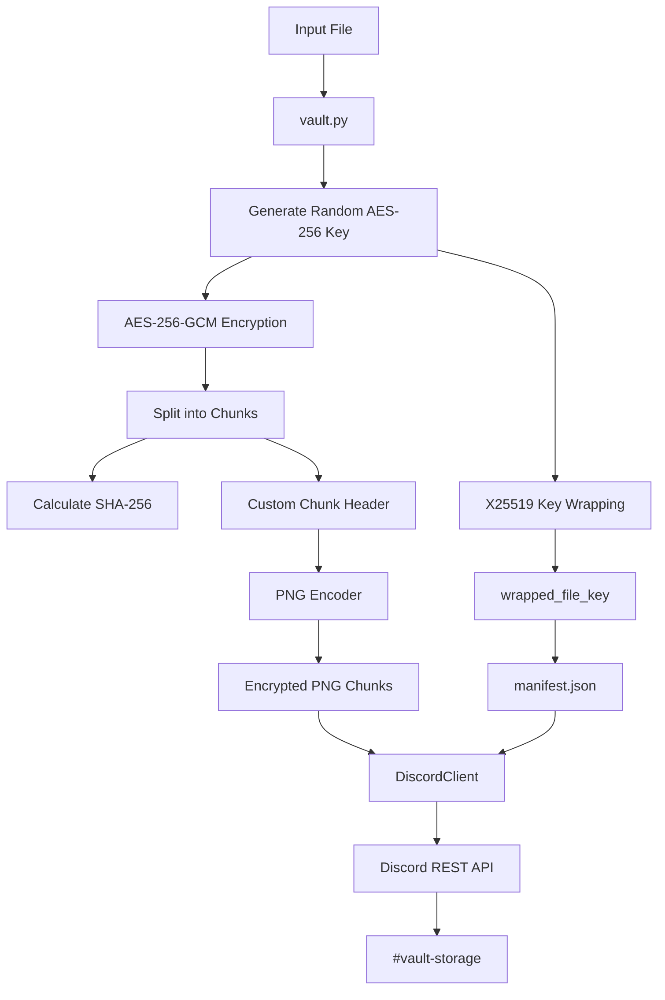

# DiscordVault

> Encrypted file storage using Discord as the storage backend.

DiscordVault is a Python-based experimental storage system that encrypts files locally, converts the encrypted data into lossless PNG chunks, and stores those chunks as Discord attachments.

The core principle is:

```text
Local File
    │
    ▼
AES-256-GCM Encryption
    │
    ▼
Encrypted Binary Chunks
    │
    ▼
PNG Encoding
    │
    ▼
Discord Attachments
```

The data is encrypted **before** it reaches Discord.

---

## Current Status

### Implemented

* [x] File encryption using **AES-256-GCM**
* [x] Per-file random encryption key
* [x] X25519-based key wrapping
* [x] HKDF-SHA256 key derivation
* [x] Local public/private key management
* [x] SHA-256 file integrity verification
* [x] SHA-256 per-chunk integrity verification
* [x] Custom binary chunk header
* [x] 1920 × 1080 RGB PNG encoding
* [x] Lossless binary-to-PNG conversion
* [x] File splitting into multiple chunks
* [x] Manifest generation
* [x] Local encryption/decryption
* [x] Discord bot integration
* [x] Discord REST API client
* [x] Upload encrypted chunks to Discord
* [x] Download attachments from Discord
* [x] Discord vault identification
* [x] Discord message pagination
* [x] Vault discovery
* [x] Complete Discord vault download
* [x] End-to-end SHA-256 verification
* [x] CLI interface

### Current tested flow

```text
test.bin
   │
   ▼
encode_file()
   │
   ├── AES-256-GCM
   ├── SHA-256
   ├── X25519 key wrapping
   └── PNG encoding
   │
   ▼
encrypted/
├── manifest.json
├── chunk_000000.png
├── chunk_000001.png
├── chunk_000002.png
└── chunk_000003.png
   │
   ▼
Discord
   │
   ▼
download
   │
   ▼
decode_file()
   │
   ▼
recovered.bin
   │
   ▼
SHA-256 comparison
   │
   ▼
Original == Recovered
```

---

# Architecture



---

# Cryptographic Design

DiscordVault uses multiple cryptographic primitives for different purposes.

## AES-256-GCM

AES-GCM provides authenticated encryption.

```text
Plaintext
    │
    ▼
AES-256-GCM
    │
    ├── Ciphertext
    └── Authentication Tag
```

This provides:

* Confidentiality
* Authentication
* Tamper detection

A modified encrypted chunk should fail AES-GCM authentication during decryption.

---

## X25519

Each file gets a randomly generated AES key.

That key must itself be protected.

DiscordVault uses X25519-based key wrapping so that the AES key can be recovered using the locally stored private key.

Conceptually:

```text
Random AES-256 Key
        │
        ▼
X25519/HKDF Key Wrapping
        │
        ▼
Wrapped AES Key
        │
        ▼
manifest.json
```

The private key remains locally stored.

```text
.discord-vault/
└── private.key
```

The private key should **never be uploaded to Discord or committed to Git**.

---

# SHA-256 Integrity

Each chunk has its own SHA-256 hash:

```json
{
    "index": 0,
    "size": 6220656,
    "sha256": "...",
    "image": "chunk_000000.png"
}
```

The complete original file also has a SHA-256 hash:

```json
{
    "file_sha256": "..."
}
```

During restoration:

```text
Downloaded Chunk
       │
       ▼
AES-GCM Authentication
       │
       ▼
Plaintext
       │
       ▼
SHA-256
       │
       ▼
Manifest Hash
```

Finally:

```text
Recovered File SHA-256
          ==
Original File SHA-256
```

---

# PNG Storage Format

DiscordVault currently uses:

```text
1920 × 1080
RGB
```

Each pixel contains three 8-bit channels:

```text
R G B
```

Therefore:

```text
1920 × 1080 × 3
= 6,220,800 bytes
```

A custom 128-byte header and AES-GCM authentication overhead are reserved.

The current plaintext chunk capacity is:

```text
6,220,656 bytes
```

The PNG is lossless, so the encoded bytes can be recovered exactly.

---

# Chunk Format

Each PNG begins logically with:

```text
┌──────────────────────────────┐
│        128-byte Header       │
├──────────────────────────────┤
│                              │
│      AES-GCM Ciphertext      │
│                              │
├──────────────────────────────┤
│           Padding            │
│                              │
└──────────────────────────────┘
```

The header contains information such as:

* Magic/version
* File ID
* Chunk index
* Total chunk count
* Plaintext size
* Nonce
* Payload size
* SHA-256 hash

---

# Manifest

Each vault contains a `manifest.json`.

Example structure:

```json
{
    "version": 1,
    "file_id": "...",
    "filename": "test.bin",
    "file_size": 20971520,
    "file_sha256": "...",
    "chunk_size": 6220656,
    "total_chunks": 4,
    "encryption": {
        "algorithm": "AES-256-GCM",
        "key_wrap": "X25519-HKDF-SHA256-AES-256-GCM"
    },
    "wrapped_file_key": {
        "ephemeral_public_key": "...",
        "nonce": "...",
        "encrypted_file_key": "..."
    },
    "chunks": []
}
```

The manifest allows the system to reconstruct and verify the vault.

---

# Discord Storage

Discord is treated as a **storage backend**, not as part of the encryption system.

```text
vault.py
   │
   │ encrypted files
   ▼
discord_client.py
   │
   │ HTTPS
   ▼
Discord REST API
```

A vault is represented by messages containing:

```text
DiscordVault vault=<FILE_ID> type=manifest
```

and:

```text
DiscordVault vault=<FILE_ID> type=chunk index=0
DiscordVault vault=<FILE_ID> type=chunk index=1
DiscordVault vault=<FILE_ID> type=chunk index=2
...
```

The encrypted PNG itself contains the actual encrypted data.

---

# Project Structure

```text
discord-vault/
│
├── src/
│   ├── __init__.py
│   ├── crypto.py
│   ├── discord_client.py
│   ├── key_manager.py
│   ├── main.py
│   └── vault.py
│
├── tests/
│   ├── __init__.py
│   ├── test_crypto.py
│   └── test_vault.py
│
├── data/
│   ├── input/
│   └── output/
│
├── .discord-vault/
│   └── private.key
│
├── .env
├── .gitignore
├── requirements.txt
└── README.md
```

---

# CLI

## Encrypt a file

```bash
python -m src.main encode \
    data/input/test.bin \
    data/output/encrypted
```

Produces:

```text
encrypted/
├── manifest.json
├── chunk_000000.png
├── chunk_000001.png
└── ...
```

## Decode a local vault

```bash
python -m src.main decode \
    data/output/encrypted \
    data/output/recovered.bin
```

## Upload a vault

```bash
python -m src.main upload \
    data/output/encrypted
```

## List Discord vaults

```bash
python -m src.main list
```

## Download a vault

```bash
python -m src.main download \
    <VAULT_ID> \
    data/output/discord-download
```

---

# Configuration

Create a `.env` file:

```env
DISCORD_BOT_TOKEN=your_bot_token
DISCORD_CHANNEL_ID=your_channel_id
```

The `.env` file should **never be committed**.

The Discord bot should have only the permissions required for the storage channel:

* View Channel
* Send Messages
* Attach Files
* Read Message History

Administrator permissions are not required.

---

# Installation

Clone the repository and create a virtual environment:

```bash
git clone <repository-url>
cd discord-vault
```

```bash
python -m venv .venv
source .venv/bin/activate
```

Install dependencies:

```bash
pip install -r requirements.txt
```

Run tests:

```bash
python -m pytest
```

---

# Security Model

The intended security boundary is:

```text
                    LOCAL MACHINE

               ┌────────────────────┐
               │    Private Key     │
               │    private.key     │
               └─────────┬──────────┘
                         │
                         ▼
Input File ────────► DiscordVault
                         │
                         ▼
                  AES-256-GCM
                         │
                         ▼
                  Encrypted Data
                         │
                         ▼
                       PNG
                         │
                         ▼
                      Discord
```

Discord receives the encrypted chunks.

The private encryption key remains on the user's machine.

### Important

If the private key is lost, encrypted vaults may become unrecoverable.

Back up the private key securely.

---

# Current Limitations

DiscordVault is currently an **experimental project**, not a production archival-storage system.

Current limitations include:

* Discord storage limits and policies can change.
* Discord API rate limits apply.
* The current implementation uses Discord messages as the vault index.
* Very large vaults require many Discord messages.
* The manifest currently exposes some metadata.
* The current CLI primarily handles files.
* Folder/archive handling is not implemented yet.
* No resumable upload system yet.
* No resumable download system yet.
* No deduplication.
* No compression pipeline.
* No multi-device key management.
* No automated key backup.
* No production-grade storage redundancy.

Do not use DiscordVault as the only backup of important data.

---

# Future Improvements

## Storage

* [ ] Folder/directory support
* [ ] Automatic ZIP/archive creation
* [ ] Upload progress bars
* [ ] Parallel chunk uploads
---

# Design Philosophy

DiscordVault follows a simple separation of responsibilities:

```text
crypto.py
    ↓
Cryptographic primitives

key_manager.py
    ↓
Key storage

vault.py
    ↓
Vault format + encryption + chunking

discord_client.py
    ↓
Discord storage backend

main.py
    ↓
CLI
```

The encryption layer should remain independent of Discord.

This makes it possible to eventually use the same vault format with:

```text
Discord
   │
   ├── Local filesystem
   ├── S3
   ├── Google Drive
   ├── Dropbox
   └── Other storage backends
```

without changing the cryptographic format.

---

# Disclaimer

DiscordVault is an experimental software project intended for learning, experimentation, and research into encrypted storage systems.

It should not be considered a replacement for dedicated cloud backup or archival-storage services.

Always maintain an independent backup of important data and the private encryption key.
