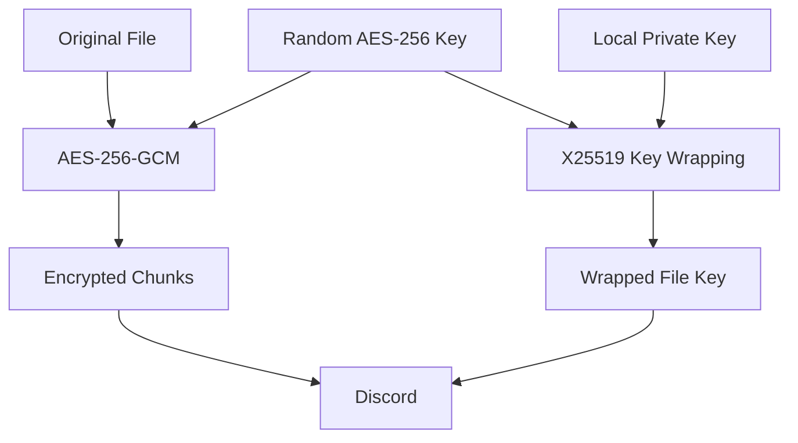

# DiscordVault

Encrypted file storage using Discord as a storage backend.

DiscordVault encrypts files locally with **AES-256-GCM**, splits the encrypted data into chunks, encodes the chunks as lossless PNGs, and stores them as Discord attachments.

> Experimental project focused on encrypted storage, cryptography, chunked data, and API-based storage backends.

---

## Architecture

```mermaid
flowchart LR
    A[File / Folder] --> B{Input Type}

    B -->|File| C[Read File]
    B -->|Folder| D[Create Temporary ZIP]

    C --> E[Generate AES-256 Key]
    D --> E

    E --> F[AES-256-GCM]
    F --> G[Encrypted Data]

    G --> H[Split into Chunks]
    H --> I[PNG Encoding]

    E --> J[X25519 Key Wrapping]
    J --> K[Wrapped File Key]

    I --> L[Encrypted PNG Chunks]
    K --> M[Manifest]

    L --> N[Discord]
    M --> N

    N --> O[Download]
    O --> P[Decrypt & Verify]
    P --> Q{Original Type}

    Q -->|File| R[Restore File]
    Q -->|Folder| S[Extract ZIP]
    S --> T[Restore Folder]
````

### Storage flow

```mermaid
sequenceDiagram
    participant User
    participant Vault as DiscordVault
    participant Discord

    User->>Vault: encode file/folder
    Vault->>Vault: Generate AES-256 key
    Vault->>Vault: Encrypt with AES-256-GCM
    Vault->>Vault: Split into chunks
    Vault->>Vault: Encode chunks as PNG
    Vault->>Vault: Create manifest
    Vault->>Discord: Upload manifest + encrypted chunks

    User->>Vault: restore VAULT_ID
    Vault->>Discord: Download vault
    Discord-->>Vault: Encrypted manifest + chunks
    Vault->>Vault: Decrypt chunks
    Vault->>Vault: Verify SHA-256
    Vault-->>User: Restore file/folder
```

---

## Features

* AES-256-GCM authenticated encryption
* X25519-based key wrapping
* HKDF-SHA256 key derivation
* SHA-256 integrity verification
* Automatic chunking
* Lossless PNG data encoding
* File and folder support
* Automatic ZIP creation for folders
* Discord bot/API storage
* Vault discovery
* Local encryption and decryption
* Download and restore

---

## Encryption Model

Each vault receives a random AES-256 encryption key.



The private key remains on the user's machine and is never uploaded to Discord.

SHA-256 is used to verify:

1. Individual chunks
2. The final reconstructed file

---

## File / Folder Encoding

Files are processed directly.

Folders are first converted into a temporary ZIP archive:

```text
my-project/
├── src/
├── tests/
└── README.md

        ↓

temporary archive.zip

        ↓

AES-256-GCM

        ↓

PNG chunks

        ↓

Discord
```

The temporary ZIP is deleted after encryption.

During restoration, it is reconstructed, verified, and safely extracted back into the original directory structure.

---

## Example

### Encrypt a file

```bash
python -m src.main encode \
    data/input/test.bin \
    data/output/vault
```

### Encrypt a folder

```bash
python -m src.main encode \
    ./my-project \
    data/output/vault
```

### Upload

```bash
python -m src.main upload \
    data/output/vault
```

### List vaults

```bash
python -m src.main list
```

Example:

```text
Vaults
────────────────────────────────────────────────

1. test.bin
   ID:       c326642e77664612924cb1746e879199
   Type:     file
   Size:     20.00 MB
   Chunks:   4

2. my-project
   ID:       91c8...
   Type:     directory
   Size:     8.42 MB
   Chunks:   2
```

### Restore

```bash
python -m src.main restore \
    <VAULT_ID> \
    ./restored-project
```

---

## Project Structure

```text
discord-vault/
│
├── src/
│   ├── crypto.py
│   ├── discord_client.py
│   ├── key_manager.py
│   ├── main.py
│   └── vault.py
│
├── tests/
├── data/
├── .discord-vault/
├── .env
├── requirements.txt
└── README.md
```

| Module              | Responsibility                             |
| ------------------- | ------------------------------------------ |
| `crypto.py`         | Encryption and key wrapping                |
| `key_manager.py`    | Local key management                       |
| `vault.py`          | Chunking, PNG encoding, manifests, restore |
| `discord_client.py` | Discord API/storage operations             |
| `main.py`           | CLI                                        |

---

## Setup

```bash
git clone <repository-url>
cd discord-vault

python -m venv .venv
source .venv/bin/activate

pip install -r requirements.txt
```

Configure the Discord bot:

```env
DISCORD_BOT_TOKEN=your_bot_token
DISCORD_CHANNEL_ID=your_channel_id
```

Generate your local keypair using the project's key-management command.

Run tests:

```bash
python -m pytest
```

---

## Security Notes

Discord receives encrypted data rather than the original plaintext.

However, Discord can still observe operational metadata such as:

* Attachment sizes
* Timestamps
* Number of stored attachments
* Vault existence

The current manifest also contains some file metadata.

**Never commit:**

```text
.env
.discord-vault/private.key
generated vault data
```

Losing the private key can make encrypted vaults unrecoverable.

---

## Future Improvements

* [ ] Encrypted manifests for stronger metadata privacy
* [ ] Resumable uploads/downloads
* [ ] Better Discord rate-limit handling
* [ ] Parallel transfers
* [ ] Compression before encryption
* [ ] Deduplication
* [ ] Incremental backups
* [ ] Additional storage backends
* [ ] Improved CLI and progress reporting

---

## Disclaimer

DiscordVault is an experimental project and should not be considered a replacement for dedicated backup or archival-storage systems.

Always maintain an independent backup of important data and your private encryption key.